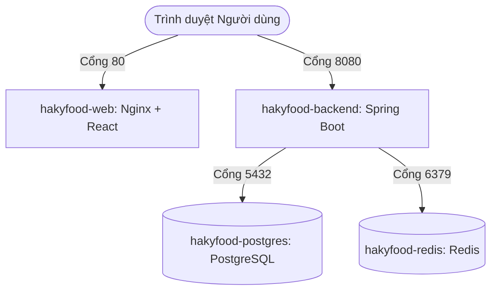

# HakyFood - Ứng Dụng Đặt Đồ Ăn Đêm Trực Tuyến

**HakyFood** là dự án xây dựng hệ thống đặt đồ ăn đêm trực tuyến với thiết kế giao diện Dark Mode Glassmorphism hiện đại cùng cơ chế xác thực an toàn, hiệu năng cao.

---

## 🛠️ Công Nghệ Sử Dụng (Tech Stack)

### 1. Frontend (Web Client)
*   **Core:** React 19, TypeScript, Vite.
*   **Routing:** TanStack Router (File-based routing).
*   **Styling:** TailwindCSS v4 (được tích hợp qua Vite plugin mới nhất).
*   **API Client:** Axios (Cấu hình tự động gửi Refresh Token qua HttpOnly Cookie).
*   **UI Helpers:** Sonner (Hiển thị thông báo Toast cao cấp), Lucide Icons.

### 2. Backend (API Server)
*   **Framework:** Spring Boot 3.x (Java 21), Spring Security.
*   **Data Access:** Spring Data JPA, Hibernate.
*   **Database:** PostgreSQL.
*   **Caching & Session:** Redis.
*   **Authentication:** JWT (Access Token dạng Bearer, Refresh Token lưu ở HttpOnly Cookie).
*   **OAuth2:** Google Identity Services (Giải mã & xác thực ID Token trực tiếp ở Backend).
*   **Mail Service:** Java Mail Sender (Gửi OTP kích hoạt tài khoản).

### 3. Containerization & DevOps
*   **Docker & Docker Compose** (Điều phối tất cả dịch vụ trong một câu lệnh).
*   **Nginx** (Phục vụ file tĩnh frontend và cấu hình fallback routing cho Single Page Application).

---

## 🏗️ Kiến Trúc Hệ Thống (Docker Services)

Hệ thống được đóng gói thành các container kết nối nội bộ qua Docker Network:



---

## 🚀 Hướng Dẫn Chạy Nhanh Bằng Docker (Quick Start)

Dự án đã được container hóa hoàn toàn. Bạn có thể khởi chạy toàn bộ hệ thống (Postgres, Redis, Backend, Frontend) chỉ với vài bước đơn giản:

### Bước 1: Tạo file cấu hình `.env`
Sao chép file cấu hình mẫu `.env.example` thành `.env` tại thư mục gốc của dự án:
```bash
cp .env.example .env
```

### Bước 2: Cập nhật thông số môi trường trong `.env`
Mở file `.env` vừa tạo và điền các thông tin của bạn:
*   `MAIL_USERNAME` và `MAIL_PASSWORD`: Tài khoản Gmail và mật khẩu ứng dụng (App Password) để gửi email chứa mã OTP.
*   `GOOGLE_CLIENT_ID`: OAuth Client ID lấy từ Google Cloud Console để phục vụ đăng nhập Google.

### Bước 3: Khởi chạy hệ thống
Chạy lệnh duy nhất để build và start toàn bộ hệ thống ở chế độ background:
```bash
docker compose up -d --build
```

### Bước 4: Truy cập ứng dụng
*   **Frontend (Giao diện người dùng):** [http://localhost](http://localhost)
*   **Backend API Base URL:** [http://localhost:8080](http://localhost:8080)

---

## 💻 Hướng Dẫn Chạy Local Cho Lập Trình Viên (Development Mode)

Khi cần phát triển hoặc debug code trực tiếp mà không muốn build lại Docker, bạn có thể chạy backend và frontend độc lập:

### 1. Chạy Backend (Spring Boot)
1. Đảm bảo bạn đã start Postgres và Redis ở chế độ Docker (hoặc cài đặt local):
   ```bash
   docker compose up -d postgres redis
   ```
2. Mở thư mục `hakyfood-backend` và khởi chạy API server:
   ```bash
   cd hakyfood-backend
   # Trên Windows (PowerShell)
   .\mvnw spring-boot:run
   # Trên Linux/macOS
   ./mvnw spring-boot:run
   ```
   *Backend sẽ chạy trên cổng `8080`*.

### 2. Chạy Frontend (React + Vite)
1. Mở thư mục `hakyfood-web` và cài đặt các thư viện:
   ```bash
   cd hakyfood-web
   npm install
   ```
2. Khởi chạy dev server:
   ```bash
   npm run dev
   ```
   *Frontend sẽ chạy trên cổng `5173` (hoặc cổng trống tiếp theo)*.

---

## 🔧 Các Câu Lệnh Hữu Ích

### 1. Xem logs của hệ thống
Xem logs thời gian thực của container backend:
```bash
docker compose logs -f backend
```

### 2. Xem danh sách User đã được tạo trong Database
Chạy truy vấn SQL trực tiếp vào container PostgreSQL để kiểm tra các tài khoản đã đăng ký:
```bash
docker exec -it hakyfood-postgres psql -U postgres -d hakyfood -c "SELECT id, email, full_name, auth_provider, account_status FROM users;"
```

### 3. Reset hoàn toàn Database (Xóa dữ liệu cũ)
Khi bạn cập nhật Entity JPA và muốn Hibernate tạo lại cấu trúc bảng mới từ đầu, hãy xóa volume dữ liệu cũ:
```bash
docker compose down -v
docker compose up -d --build
```
